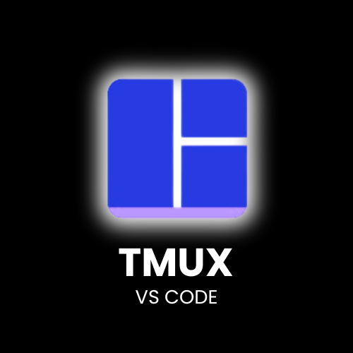

# TMUX for VSCode README

This is an extension that allows has direct integration of TMUX inside VS Code.
TMUX is a terminal multiplexer. For more information, watch [TMUX in 100 Seconds](https://www.youtube.com/watch?v=vtB1J_zCv8I) by Fireship.

## Features

- `cmd+g g` or `ctrl+g g` for opening TMUX
- You can also server for TMUX in the command pallet (`cmd + shift + p` -> TMUX)
- users can add a custom keybind to the function `tmux.openTmux`.

## Requirements

- TMUX must be installed on your system.
- For TMUX installation, look at TMUX Github repository -> https://github.com/tmux/tmux

## Known Issues

- No known issues, you can open issues here -> https://github.com/WilliamFernsV3/tmux-for-vscode
- Your contributions in the issues would be appreciated

## Release Notes

- If TMUX is already open, the focus is returned to the terminal, instead of opening a new instance of TMUX.
- Fixed issue: when TMUX is opened, if any other terminals are active, terminal panel is not opened.

### 1.0.0

Initial release of TMUX for VSCode

### 1.0.1

Added `tmux.closeNonTerminalEditors` command.

### 1.0.2 - 1.0.5

Fixed `tmux.closeNonTerminalEditors` command, added description

<!-- Fixed issue #.

### 1.1.0

Added features X, Y, and Z.

---

## Following extension guidelines

Ensure that you've read through the extensions guidelines and follow the best practices for creating your extension.

- [Extension Guidelines](https://code.visualstudio.com/api/references/extension-guidelines)

## Working with Markdown

You can author your README using Visual Studio Code. Here are some useful editor keyboard shortcuts:

- Split the editor (`Cmd+\` on macOS or `Ctrl+\` on Windows and Linux).
- Toggle preview (`Shift+Cmd+V` on macOS or `Shift+Ctrl+V` on Windows and Linux).
- Press `Ctrl+Space` (Windows, Linux, macOS) to see a list of Markdown snippets.

## For more information

- [Visual Studio Code's Markdown Support](http://code.visualstudio.com/docs/languages/markdown)
- [Markdown Syntax Reference](https://help.github.com/articles/markdown-basics/)
  -->

**Enjoy!**
